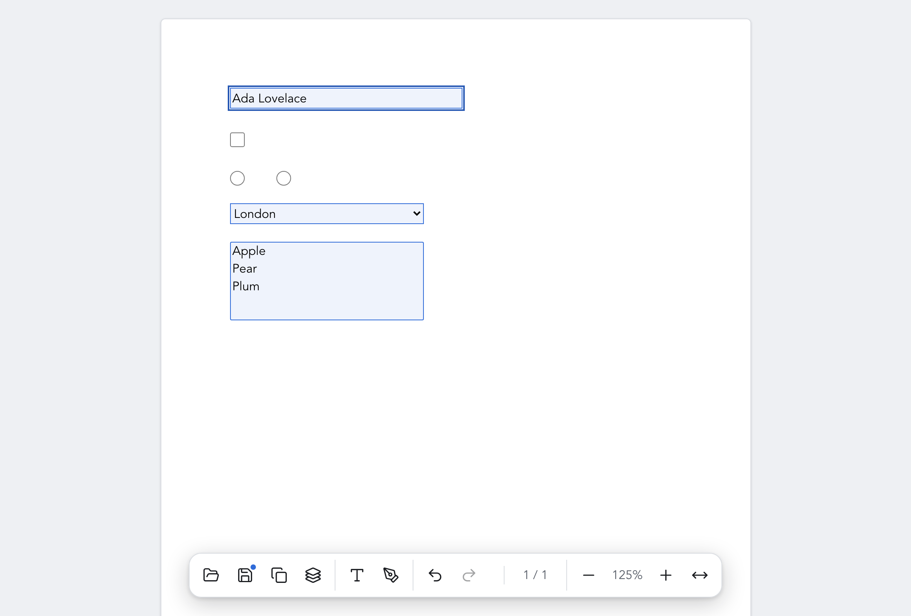
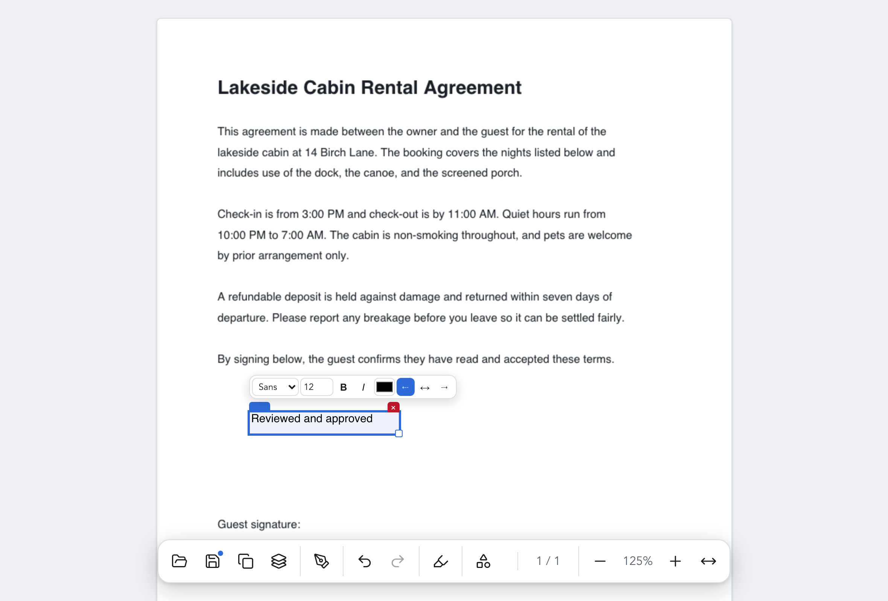
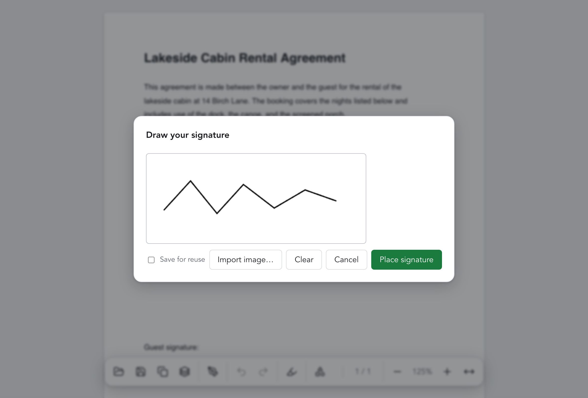

# SignetPDF

A minimal, free, cross-platform PDF viewer for filling forms, editing text and signing.

SignetPDF is a desktop app (Tauri 2 + Vite + TypeScript) that opens a PDF, fills its
AcroForm fields, adds free-text annotations, and places a visual signature, then saves the
result back to a real PDF. It is deliberately small: no accounts, no cloud, no telemetry.

## Status

Active development; latest release 0.4.0. Working today: AcroForm filling; free-text
annotations with bold/italic/colour/alignment and a sans/serif/mono font choice; drawn or
imported signatures, with reuse and a saved-signature manager; selectable text with copy;
find-in-document; a custom right-click menu; keyboard move/resize of annotations with
snapping; undo/redo; and flatten-on-export. Binary signing and notarization are the main
gap. See the build plan in the [beads](https://github.com/gastownhall/beads) tracker under
`.beads/` (`bd ready` to list available work), the [changelog](CHANGELOG.md) for release
history, and [KNOWN_ISSUES.md](KNOWN_ISSUES.md) for current limitations.

## Screenshots

Filling an AcroForm — text, checkbox, radio, dropdown and list fields — with the
floating dock and the unsaved-changes dot on Save:



Adding free text, with the inline formatting toolbar (font, size, bold, italic,
colour, alignment):



Drawing a signature to place on the page (or import an image, and save it for
reuse):



## Install

Prebuilt installers for macOS, Windows and Linux are attached to every
[release](https://github.com/acornelissen/signetpdf/releases/latest). They are
**not yet code-signed or notarized**, so your OS will warn on first launch — the
steps below clear that once. Signing is planned; see
[KNOWN_ISSUES.md](KNOWN_ISSUES.md). Prefer to build it yourself? See
[Build](#build).

**macOS** (`.dmg`) — open the disk image and drag SignetPDF into Applications.
Gatekeeper blocks the unsigned app on first launch; do one of:

- Right-click (Control-click) SignetPDF in Applications → **Open** → **Open**. On
  macOS 15+ you may instead need **System Settings → Privacy & Security → Open
  Anyway** after the first attempt.
- Or clear the quarantine flag in Terminal:
  `xattr -dr com.apple.quarantine /Applications/SignetPDF.app`

**Windows** (`.msi` or `_x64-setup.exe`) — run the installer. If SmartScreen
shows "Windows protected your PC", click **More info → Run anyway**.

**Linux** — pick the package for your distribution:

- AppImage: `chmod +x SignetPDF_*_amd64.AppImage && ./SignetPDF_*_amd64.AppImage`
- Debian/Ubuntu: `sudo apt install ./SignetPDF_*_amd64.deb`
- Fedora/RHEL: `sudo dnf install ./SignetPDF-*.x86_64.rpm`

## Requirements

Runtimes are pinned with [mise](https://mise.jdx.dev/):

```
mise install        # node 22, rust stable
npm install
```

You also need the [Tauri prerequisites](https://tauri.app/start/prerequisites/) for your OS
(on macOS, the Xcode Command Line Tools).

## Develop

```
npm run tauri dev     # launch the desktop app
npm test              # Vitest suite (headless)
npm run typecheck     # tsc --noEmit
npm run lint          # ESLint + Prettier
npm run format        # Prettier, write mode
```

Rust unit tests for the Tauri commands live in `src-tauri` and run with `cargo test`.

## Build

```
npm run tauri build   # produce a platform bundle in src-tauri/target
```

Binary code-signing and notarization are not done yet: macOS builds are unnotarized
(Gatekeeper warning) and Windows builds are unsigned (SmartScreen warning). See
[KNOWN_ISSUES.md](KNOWN_ISSUES.md) for the launch workarounds and other limitations.

## License

[Apache-2.0 with the Commons Clause](LICENSE), copyright The SignetPDF
contributors. The Commons Clause adds one restriction on top of Apache-2.0: you
may not sell the software (or a product/service whose value derives substantially
from it). All other Apache-2.0 rights — use, modify, and redistribute for
non-commercial purposes — are unchanged.
